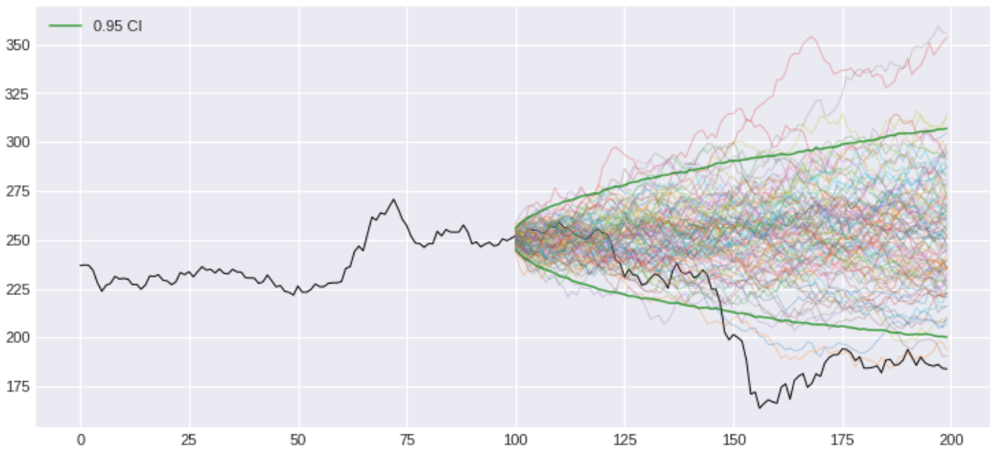

## Return to Return to RiskMetrics

Notes I've made, skimming through RiskMetrics&trade; report "Return to RiskMetrics: The Evolution of a Standard" (2001) by Jorge Mina and Jerry Yi Xiao.  
  
**Why?** The original report, to which this one is a follow-up -- "RiskMetrics -- Technical Document" (1996 4th ed) -- has been hugely influential in the field of risk management. The techniques outlined might feel dated today (and they probably are), but it seems like a useful intro to the risk modeling in general, with more applied real-world perspective than usual textbook expositions, but more rigorous than most tutorials.
  
## Sources
  
[1] Return to RiskMetrics: The Evolution of a Standard, Jorge Mina and Jerry Yi Xiao, 2001 RiskMetrics Group, Inc.  
[2] RiskMetrics — Technical Document (Fourth Edition, December 1996), Morgan Guaranty Trust Company of New York

## Contents

1. [Intro](#intro)
    * 1.1 [Basic risk factors mapping](#basic-risk-factors-mapping)
    * 1.2 [Basic model](#basic-model)
    * 1.3 [Brief aside on notation](#brief-aside-on-notation)
2. [Demonstration: real stock data](#demonstration-real-stock-data)
    * 2.1 [Data wrangling](#data-wrangling)
    * 2.2 [Implementation](#implementation)
    * 2.3 [Start](#start)
    * 2.4 [Plots](#plots)
    * 2.5 [Checking against theory](#checking-against-theory)
    * 2.6 [Back to risks](#back-to-risks)
    * 2.7 [VAR](#var)
3. [Conclusion: does it all make sense?](#conclusion-does-it-all-make-sense)
4. [Sources](#sources)